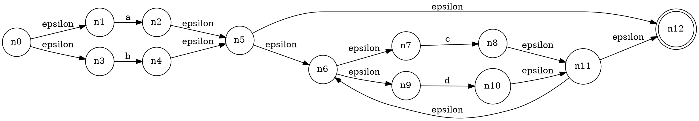
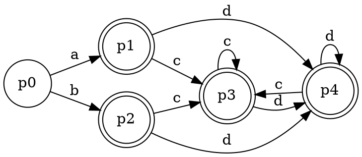
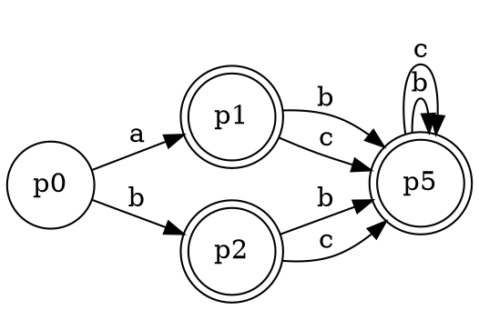
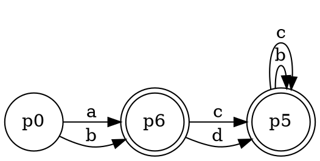
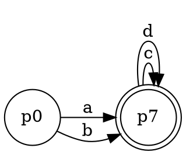

给定如下的正则表达式 (a|b)((c|d)*)，请完成如下练习：
（1）使用Thompson算法，将该正则表达式转换成非确定状态有限自动机（NFA）；

（2）使用子集构造算法，将该上述的非确定有限状态自动机（NFA）转换成确定状态有限自动机（DFA）；
p0{n0,n1,n3}

p0+a = p1{n2,n5,n6,n7,n9,n12}
p0+b = p2{n4,n5,n6,n7,n9,n12}

p1+c = p2+c = p3{n8,n11,n12,n5,n6,n7,n9}
p1+d = p2+d = p4{n10,n11,n12,n5,n6,n7,n9}

p3+c = p3
p3+d = p4

p4+c = p3
p4+d = p4

（3）使用Hopcroft算法，对该DFA最小化。
p5 = p3+p4

p6 = p1+p2

p7 = p5+p6

